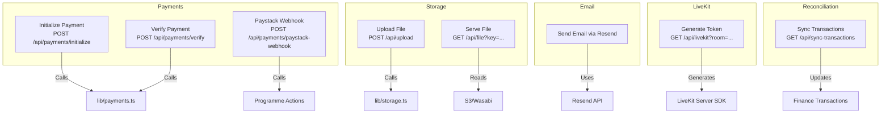
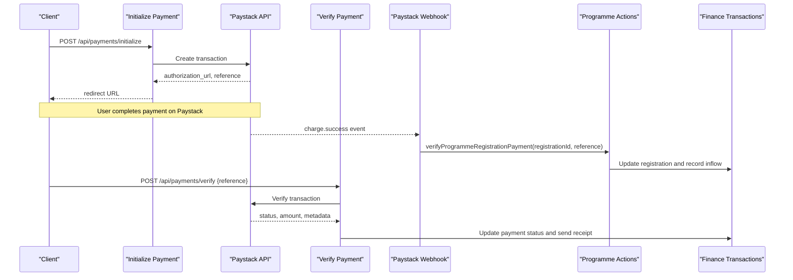
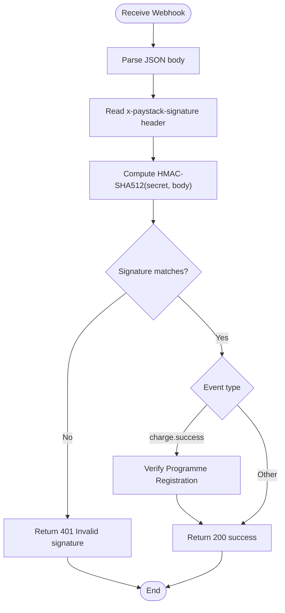
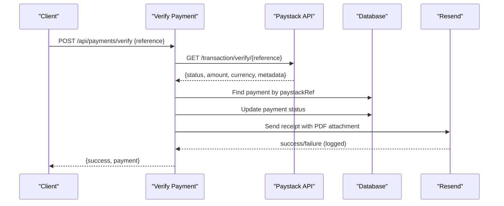
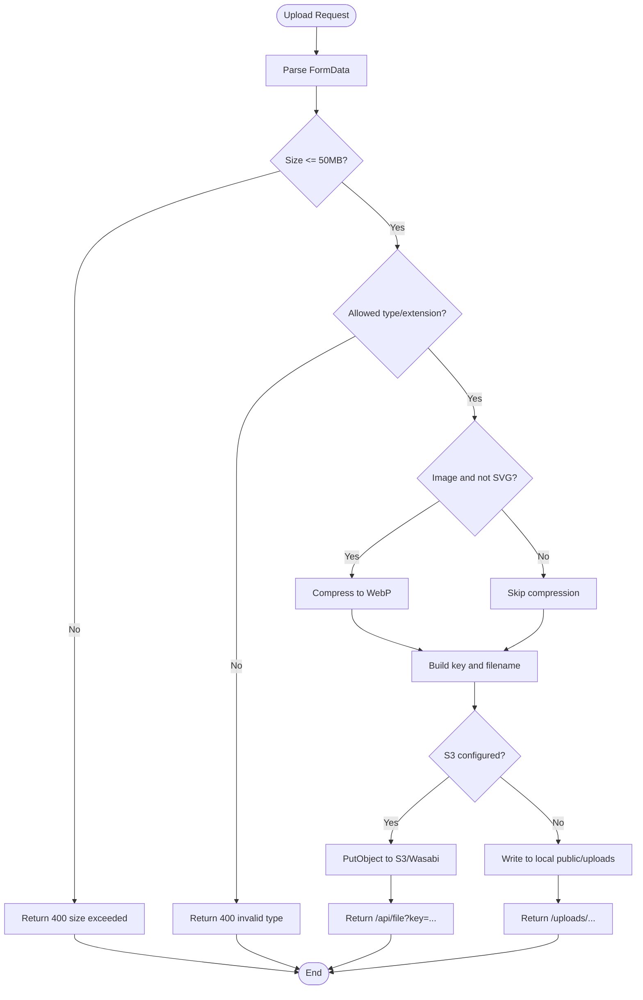
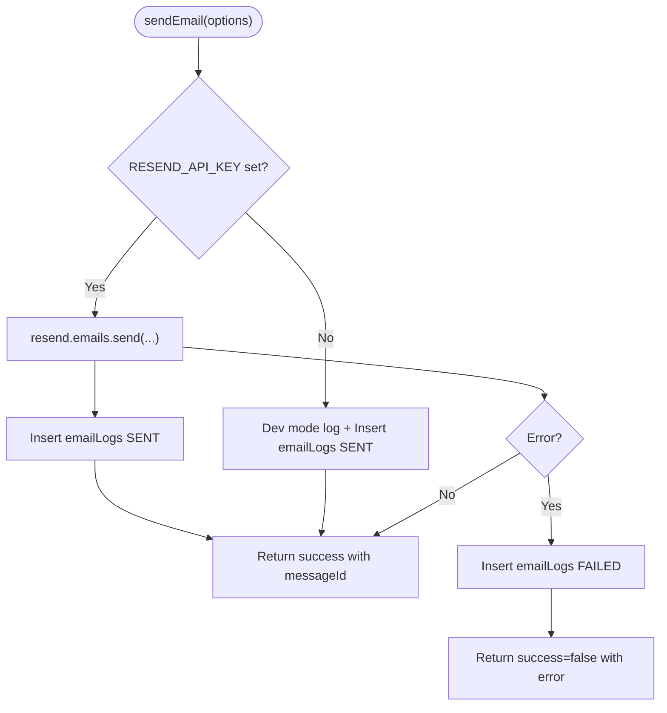
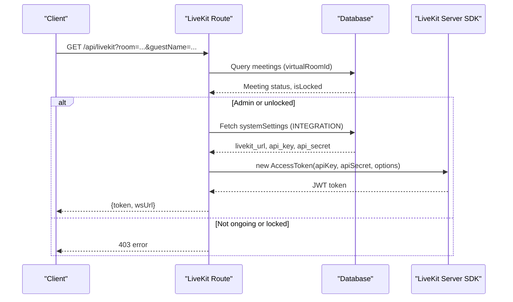
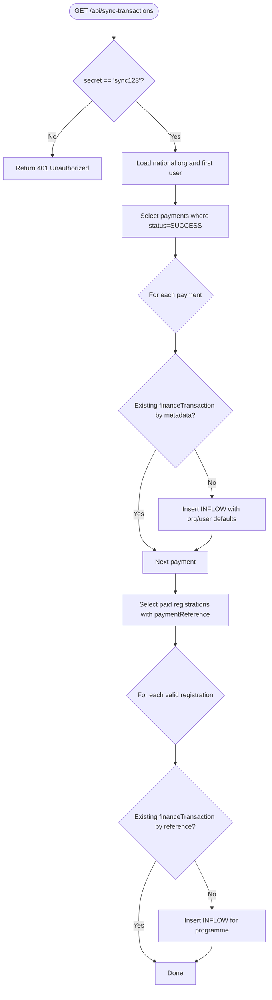
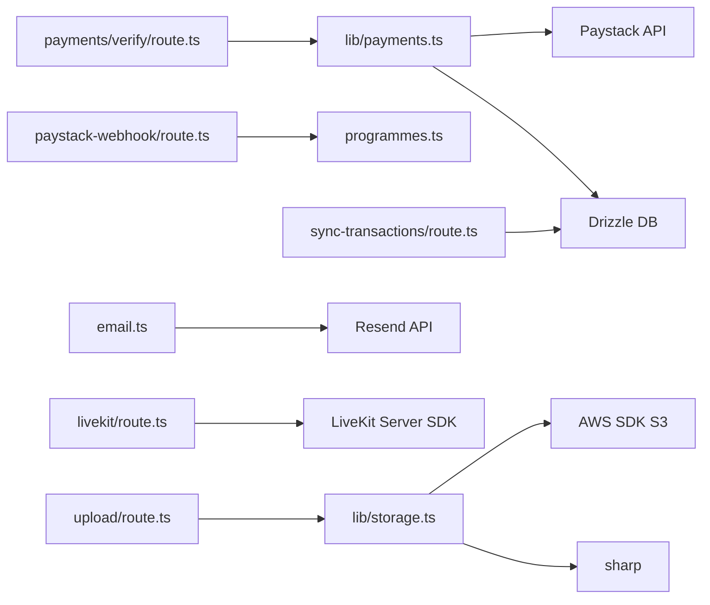

# Payment & External Service Errors

<cite>
**Referenced Files in This Document**
- [paystack-webhook/route.ts](file://app/api/payments/paystack-webhook/route.ts)
- [payments/verify/route.ts](file://app/api/payments/verify/route.ts)
- [payments/initialize/route.ts](file://app/api/payments/initialize/route.ts)
- [payments.ts](file://lib/payments.ts)
- [storage.ts](file://lib/storage.ts)
- [upload/route.ts](file://app/api/upload/route.ts)
- [file/route.ts](file://app/api/file/route.ts)
- [email.ts](file://lib/email.ts)
- [livekit/route.ts](file://app/api/livekit/route.ts)
- [sync-transactions/route.ts](file://app/api/sync-transactions/route.ts)
- [programmes.ts](file://lib/actions/programmes.ts)
</cite>

## Table of Contents
1. Introduction
2. Project Structure
3. Core Components
4. Architecture Overview
5. Detailed Component Analysis
6. Dependency Analysis
7. Performance Considerations
8. Troubleshooting Guide
9. Conclusion
10. Appendices

## Introduction
This document provides comprehensive troubleshooting guidance for payment processing and external service integrations in the TMC Portal. It focuses on Paystack webhook handling, payment verification failures, transaction reconciliation, API rate limiting, network timeouts, SSL configuration issues, file upload failures to AWS S3/Wasabi, email delivery problems with Resend, LiveKit video conferencing connectivity issues, third-party authentication errors, API key misconfiguration, subscription billing complications, debugging techniques (webhook signature verification, status synchronization, retry logic), error handling patterns, logging strategies, fallback mechanisms, and monitoring/alerting setup for external dependencies.

## Project Structure
The payment and integration flows span several Next.js API routes and shared libraries:
- Payments: initialization, verification, and Paystack webhook handling
- Storage: S3/Wasabi uploads with local fallback
- Email: Resend-based delivery with DB logging
- LiveKit: token generation and room access control
- Reconciliation: sync tool to align payments and finance records

**Diagram sources**
- [payments/initialize/route.ts:11-85](file://app/api/payments/initialize/route.ts#L11-L85)
- [payments/verify/route.ts:10-92](file://app/api/payments/verify/route.ts#L10-L92)
- [paystack-webhook/route.ts:7-40](file://app/api/payments/paystack-webhook/route.ts#L7-L40)
- [payments.ts:18-96](file://lib/payments.ts#L18-L96)
- [storage.ts:25-99](file://lib/storage.ts#L25-L99)
- [upload/route.ts:4-64](file://app/api/upload/route.ts#L4-L64)
- [file/route.ts:22-59](file://app/api/file/route.ts#L22-L59)
- [email.ts:21-91](file://lib/email.ts#L21-L91)
- [livekit/route.ts:9-106](file://app/api/livekit/route.ts#L9-L106)
- [sync-transactions/route.ts:8-119](file://app/api/sync-transactions/route.ts#L8-L119)
- [programmes.ts:17-19](file://lib/actions/programmes.ts#L17-L19)

**Section sources**
- [payments/initialize/route.ts:11-85](file://app/api/payments/initialize/route.ts#L11-L85)
- [payments/verify/route.ts:10-92](file://app/api/payments/verify/route.ts#L10-L92)
- [paystack-webhook/route.ts:7-40](file://app/api/payments/paystack-webhook/route.ts#L7-L40)
- [payments.ts:18-96](file://lib/payments.ts#L18-L96)
- [storage.ts:25-99](file://lib/storage.ts#L25-L99)
- [upload/route.ts:4-64](file://app/api/upload/route.ts#L4-L64)
- [file/route.ts:22-59](file://app/api/file/route.ts#L22-L59)
- [email.ts:21-91](file://lib/email.ts#L21-L91)
- [livekit/route.ts:9-106](file://app/api/livekit/route.ts#L9-L106)
- [sync-transactions/route.ts:8-119](file://app/api/sync-transactions/route.ts#L8-L119)
- [programmes.ts:17-19](file://lib/actions/programmes.ts#L17-L19)

## Core Components
- Paystack Integration: Initialize payments, verify transactions, handle webhooks, update statuses, and reconcile financial inflows.
- Storage Integration: Upload files to S3/Wasabi with image compression and a local fallback; serve files via a secure proxy endpoint.
- Email Delivery: Send emails via Resend with DB logging and development-mode fallback.
- LiveKit Integration: Generate tokens based on meeting state and user permissions; read settings from database or environment.
- Transaction Reconciliation: Sync successful payments and programme registrations into finance transactions.

**Section sources**
- [payments.ts:18-96](file://lib/payments.ts#L18-L96)
- [storage.ts:25-99](file://lib/storage.ts#L25-L99)
- [email.ts:21-91](file://lib/email.ts#L21-L91)
- [livekit/route.ts:9-106](file://app/api/livekit/route.ts#L9-L106)
- [sync-transactions/route.ts:8-119](file://app/api/sync-transactions/route.ts#L8-L119)

## Architecture Overview
The system orchestrates multiple external services with clear boundaries and fallbacks:
- Payments flow uses Paystack APIs with retries handled at the caller level and robust error mapping.
- Storage uses an S3-compatible client with optional image compression and a local filesystem fallback.
- Email uses Resend with DB audit logs and dev-mode logging when keys are missing.
- LiveKit token generation reads credentials from DB/system settings and enforces meeting state checks.
- Reconciliation ensures financial records reflect successful payments and paid registrations.

**Diagram sources**
- [payments/initialize/route.ts:11-85](file://app/api/payments/initialize/route.ts#L11-L85)
- [payments.ts:18-96](file://lib/payments.ts#L18-L96)
- [paystack-webhook/route.ts:7-40](file://app/api/payments/paystack-webhook/route.ts#L7-L40)
- [programmes.ts:17-19](file://lib/actions/programmes.ts#L17-L19)
- [payments/verify/route.ts:10-92](file://app/api/payments/verify/route.ts#L10-L92)

## Detailed Component Analysis

### Paystack Webhook Handling
- Signature Verification: Uses HMAC-SHA512 with secret key from environment; rejects invalid signatures with 401.
- Event Routing: Handles charge.success events and verifies programme registration payments using metadata.
- Error Handling: Logs errors and returns 500 for unhandled exceptions.

**Diagram sources**
- [paystack-webhook/route.ts:7-40](file://app/api/payments/paystack-webhook/route.ts#L7-L40)

**Section sources**
- [paystack-webhook/route.ts:7-40](file://app/api/payments/paystack-webhook/route.ts#L7-L40)

### Payment Verification Flow
- Validates request payload and calls Paystack verification.
- Updates payment status and sends confirmation email with PDF receipt attachment.
- Audits verification actions and handles receipt generation/send failures gracefully.

**Diagram sources**
- [payments/verify/route.ts:10-92](file://app/api/payments/verify/route.ts#L10-L92)
- [payments.ts:60-96](file://lib/payments.ts#L60-L96)
- [email.ts:21-91](file://lib/email.ts#L21-L91)

**Section sources**
- [payments/verify/route.ts:10-92](file://app/api/payments/verify/route.ts#L10-L92)
- [payments.ts:60-96](file://lib/payments.ts#L60-L96)
- [email.ts:21-91](file://lib/email.ts#L21-L91)

### File Upload to S3/Wasabi
- Validates file size and MIME types/extensions.
- Compresses images unless disabled; stores processed buffer.
- Uploads to S3/Wasabi if configured; otherwise falls back to local storage.
- Returns a proxied URL for secure streaming via /api/file.

**Diagram sources**
- [upload/route.ts:4-64](file://app/api/upload/route.ts#L4-L64)
- [storage.ts:25-99](file://lib/storage.ts#L25-L99)

**Section sources**
- [upload/route.ts:4-64](file://app/api/upload/route.ts#L4-L64)
- [storage.ts:25-99](file://lib/storage.ts#L25-L99)

### Email Delivery with Resend
- Sends emails via Resend when API key is present; logs attempts and results to DB.
- In development mode (no API key), logs messages and marks as sent for testing.
- Captures errors and persists failure details for auditing.

**Diagram sources**
- [email.ts:21-91](file://lib/email.ts#L21-L91)

**Section sources**
- [email.ts:21-91](file://lib/email.ts#L21-L91)

### LiveKit Video Conferencing Connectivity
- Enforces meeting state checks (ongoing, locked) and admin privileges.
- Reads LiveKit credentials from DB/system settings or environment variables.
- Generates AccessToken with appropriate grants and returns token plus WebSocket URL.

**Diagram sources**
- [livekit/route.ts:9-106](file://app/api/livekit/route.ts#L9-L106)

**Section sources**
- [livekit/route.ts:9-106](file://app/api/livekit/route.ts#L9-L106)

### Transaction Reconciliation
- Scans successful payments and paid programme registrations.
- Inserts finance transactions for missing entries, using fallback organization/user IDs when necessary.
- Supports deduplication via metadata references.

**Diagram sources**
- [sync-transactions/route.ts:8-119](file://app/api/sync-transactions/route.ts#L8-L119)

**Section sources**
- [sync-transactions/route.ts:8-119](file://app/api/sync-transactions/route.ts#L8-L119)

## Dependency Analysis
- Payments depend on Paystack API and Drizzle ORM for persistence; they also integrate with email and invoice generation.
- Storage depends on AWS SDK for S3 and sharp for image processing; it supports custom endpoints for Wasabi/R2/MinIO.
- Email depends on Resend SDK and DB for logging.
- LiveKit depends on server SDK and DB/system settings for credentials and room validation.
- Reconciliation depends on DB schemas for payments, programmeRegistrations, programmes, organizations, users, and financeTransactions.

**Diagram sources**
- [payments.ts:18-96](file://lib/payments.ts#L18-L96)
- [payments/verify/route.ts:10-92](file://app/api/payments/verify/route.ts#L10-L92)
- [paystack-webhook/route.ts:7-40](file://app/api/payments/paystack-webhook/route.ts#L7-L40)
- [programmes.ts:17-19](file://lib/actions/programmes.ts#L17-L19)
- [upload/route.ts:4-64](file://app/api/upload/route.ts#L4-L64)
- [storage.ts:25-99](file://lib/storage.ts#L25-L99)
- [email.ts:21-91](file://lib/email.ts#L21-L91)
- [livekit/route.ts:9-106](file://app/api/livekit/route.ts#L9-L106)
- [sync-transactions/route.ts:8-119](file://app/api/sync-transactions/route.ts#L8-L119)

**Section sources**
- [payments.ts:18-96](file://lib/payments.ts#L18-L96)
- [storage.ts:25-99](file://lib/storage.ts#L25-L99)
- [email.ts:21-91](file://lib/email.ts#L21-L91)
- [livekit/route.ts:9-106](file://app/api/livekit/route.ts#L9-L106)
- [sync-transactions/route.ts:8-119](file://app/api/sync-transactions/route.ts#L8-L119)

## Performance Considerations
- Image Compression: Sharp-based compression reduces bandwidth and storage costs; can be disabled via environment variable for large media.
- Streaming Downloads: Serving files via /api/file streams content directly from S3/Wasabi, minimizing memory usage.
- Database Queries: Reconciliation scans use indexed filters (status, paymentReference) and avoid unnecessary joins; consider adding indexes for frequently queried fields.
- Network Calls: Paystack and Resend calls should implement exponential backoff and circuit breakers to mitigate transient failures and rate limits.

[No sources needed since this section provides general guidance]

## Troubleshooting Guide

### Paystack Webhook Issues
- Symptom: Webhook rejected with 401 Invalid signature.
  - Cause: Missing or incorrect PAYSTACK_SECRET_KEY; mismatched payload hashing.
  - Fix: Ensure PAYSTACK_SECRET_KEY is set and identical to Paystack dashboard; verify that the entire JSON body is hashed exactly as received.
  - Debug: Log both computed hash and incoming signature; compare payloads character-by-character.
- Symptom: charge.success not updating registration.
  - Cause: Metadata missing or wrong registrationId/type.
  - Fix: Confirm metadata includes type=PROGRAMME_REGISTRATION and registrationId; ensure verifyProgrammeRegistrationPayment handles these fields.
  - Debug: Inspect webhook payload and console logs for registrationId presence.

**Section sources**
- [paystack-webhook/route.ts:7-40](file://app/api/payments/paystack-webhook/route.ts#L7-L40)
- [programmes.ts:17-19](file://lib/actions/programmes.ts#L17-L19)

### Payment Verification Failures
- Symptom: Verification returns failure or payment not found.
  - Cause: Incorrect reference; Paystack API error; payment record missing.
  - Fix: Validate reference format; check Paystack dashboard for transaction status; ensure createPaymentRecord was called before verification.
  - Debug: Log Paystack response and DB lookup results; capture full error message.
- Symptom: Receipt email not sent.
  - Cause: PDF generation or Resend failure.
  - Fix: Check RESEND_API_KEY; validate email templates; inspect emailLogs for failures.
  - Debug: Review error logs and emailLogs table for provider errors.

**Section sources**
- [payments/verify/route.ts:10-92](file://app/api/payments/verify/route.ts#L10-L92)
- [payments.ts:60-96](file://lib/payments.ts#L60-L96)
- [email.ts:21-91](file://lib/email.ts#L21-L91)

### Transaction Reconciliation Problems
- Symptom: Finance transactions missing after successful payments.
  - Cause: Deduplication skipped due to metadata mismatch; default org/user missing.
  - Fix: Ensure paystackRef/id is stored consistently; configure national org and first user; run sync with correct secret.
  - Debug: Run GET /api/sync-transactions?secret=sync123 and review stats; check existing metadata values.
- Symptom: Programme registration inflows not recorded.
  - Cause: Status not PAID/PARTIALLY_PAID or amount zero.
  - Fix: Ensure registration status updated correctly; confirm amountPaid > 0.
  - Debug: Inspect programmeRegistrations and programmes tables; verify organizationId exists.

**Section sources**
- [sync-transactions/route.ts:8-119](file://app/api/sync-transactions/route.ts#L8-L119)

### API Rate Limiting Errors
- Symptom: Paystack or Resend returns rate limit errors.
  - Cause: Excessive requests without backoff.
  - Fix: Implement exponential backoff and jitter; queue retries; reduce polling frequency.
  - Debug: Log HTTP status codes and response headers; monitor retry counts.

[No sources needed since this section provides general guidance]

### Network Timeout Problems
- Symptom: Requests to Paystack/Resend/S3 time out.
  - Cause: Network instability; long-running operations; insufficient timeout settings.
  - Fix: Configure timeouts; add retries; use streaming for large downloads; monitor DNS and TLS handshake times.
  - Debug: Capture latency metrics; check server logs for timeout errors.

[No sources needed since this section provides general guidance]

### SSL Certificate Configuration Issues
- Symptom: S3/Wasabi uploads fail with SSL errors.
  - Cause: Custom endpoint requires proper CA bundle or forcePathStyle misconfiguration.
  - Fix: Set WASABI_ENDPOINT/AWS_ENDPOINT correctly; enable forcePathStyle for S3-compatible services; ensure region matches endpoint.
  - Debug: Test endpoint connectivity; inspect S3Client configuration and error messages.

**Section sources**
- [storage.ts:6-23](file://lib/storage.ts#L6-L23)
- [file/route.ts:4-20](file://app/api/file/route.ts#L4-L20)

### File Upload Failures to AWS S3/Wasabi
- Symptom: Upload returns 500 or fails silently.
  - Cause: Missing credentials; bucket policy denies writes; file type blocked; compression errors.
  - Fix: Validate WASABI_* or AWS_* env vars; ensure bucket allows public-read or adjust ACL; allow required MIME types; disable compression if problematic.
  - Debug: Check upload route logs and storage logs; test PutObjectCommand directly.

**Section sources**
- [upload/route.ts:4-64](file://app/api/upload/route.ts#L4-L64)
- [storage.ts:25-99](file://lib/storage.ts#L25-L99)

### Email Delivery Problems with Resend
- Symptom: Emails not delivered or logged incorrectly.
  - Cause: Missing RESEND_API_KEY; invalid recipient; template errors; provider-side failures.
  - Fix: Set RESEND_API_KEY; validate recipients; check emailTemplates; review emailLogs for errors.
  - Debug: Use dev mode to log emails; inspect providerId and error fields in emailLogs.

**Section sources**
- [email.ts:21-91](file://lib/email.ts#L21-L91)

### LiveKit Video Conferencing Connectivity Issues
- Symptom: Cannot join room; token generation fails.
  - Cause: Meeting not ongoing or locked; missing LiveKit credentials; unauthorized guest.
  - Fix: Ensure meeting status ONGOING and not locked; configure livekit_url, livekit_api_key, livekit_api_secret in system settings; provide guestName for guests.
  - Debug: Check DB queries for virtualRoomId; inspect systemSettings; review token generation logs.

**Section sources**
- [livekit/route.ts:9-106](file://app/api/livekit/route.ts#L9-L106)

### Third-Party Service Authentication Problems
- Symptom: Paystack or LiveKit returns authentication errors.
  - Cause: Incorrect API keys or secrets; environment vs DB configuration mismatch.
  - Fix: Verify PAYSTACK_SECRET_KEY/LIVEKIT_API_KEY/LIVEKIT_API_SECRET; ensure consistent configuration across environments.
  - Debug: Log credential presence flags; test minimal API calls.

**Section sources**
- [payments.ts:6-8](file://lib/payments.ts#L6-L8)
- [livekit/route.ts:76-95](file://app/api/livekit/route.ts#L76-L95)

### API Key Configuration Errors
- Symptom: Services unavailable due to missing keys.
  - Cause: Environment variables not set; typos; precedence issues (DB vs env).
  - Fix: Standardize key names; prefer DB settings for dynamic updates; validate presence before use.
  - Debug: Add health checks that assert key presence; log configuration snapshots.

**Section sources**
- [livekit/route.ts:76-95](file://app/api/livekit/route.ts#L76-L95)
- [storage.ts:6-23](file://lib/storage.ts#L6-L23)

### Subscription Billing Complications
- Symptom: Subscriptions not recognized or recurring charges fail.
  - Cause: Missing subaccount code; incorrect metadata; Paystack subscription lifecycle not handled.
  - Fix: Ensure subaccount is set per organization/programme; track subscription events in webhooks; reconcile recurring payments.
  - Debug: Inspect Paystack subscription events; map them to user subscriptions; verify finance inflows.

[No sources needed since this section provides general guidance]

### Debugging Techniques
- Webhook Signature Verification:
  - Recompute HMAC-SHA512 with secret key and compare to header; log both values for comparison.
  - Ensure no extra whitespace or encoding differences in payload.
- Payment Status Synchronization:
  - Use /api/payments/verify to reconcile; run /api/sync-transactions to fill gaps.
  - Monitor emailLogs and audit logs for verification actions.
- Retry Logic Implementation:
  - Wrap external calls with retry middleware; implement exponential backoff and jitter; cap max retries.
  - Track retry counts in logs and metrics.

**Section sources**
- [paystack-webhook/route.ts:7-40](file://app/api/payments/paystack-webhook/route.ts#L7-L40)
- [payments/verify/route.ts:10-92](file://app/api/payments/verify/route.ts#L10-L92)
- [sync-transactions/route.ts:8-119](file://app/api/sync-transactions/route.ts#L8-L119)

### Error Handling Patterns and Logging Strategies
- Centralized Error Mapping:
  - Normalize API errors to consistent shapes; include context (endpoint, payload, timestamp).
- Structured Logging:
  - Log request IDs, user context, and external service responses; redact sensitive data.
- Audit Trails:
  - Record critical actions (payment verification, email sends) in audit logs for traceability.

**Section sources**
- [payments/verify/route.ts:81-87](file://app/api/payments/verify/route.ts#L81-L87)
- [email.ts:37-49](file://lib/email.ts#L37-L49)

### Fallback Mechanisms for Service Unavailability
- Storage Fallback:
  - If S3/Wasabi unavailable, write to local filesystem and return local URLs; later migrate to cloud.
- Email Fallback:
  - In dev mode, log emails instead of sending; persist logs for later replay.
- LiveKit Fallback:
  - If credentials missing, return clear error and block access; alert admins to configure settings.

**Section sources**
- [storage.ts:85-99](file://lib/storage.ts#L85-L99)
- [email.ts:56-76](file://lib/email.ts#L56-L76)
- [livekit/route.ts:92-95](file://app/api/livekit/route.ts#L92-L95)

### Monitoring and Alerting Setup
- Metrics:
  - Track success/failure rates for Paystack, Resend, S3/Wasabi, LiveKit; measure latency percentiles.
- Alerts:
  - Alert on webhook signature mismatches, repeated verification failures, upload errors, email delivery failures, LiveKit token generation errors.
- Dashboards:
  - Visualize payment volumes, reconciliation gaps, and external service health.

[No sources needed since this section provides general guidance]

## Conclusion
The TMC Portal integrates multiple external services with robust error handling, logging, and fallbacks. By following the troubleshooting steps and implementing recommended monitoring and alerting, teams can quickly diagnose and resolve issues related to payments, storage, email, and video conferencing. Consistent configuration management and structured logging are essential for maintaining reliability and observability.

[No sources needed since this section summarizes without analyzing specific files]

## Appendices

### Configuration Keys Reference
- Paystack: PAYSTACK_SECRET_KEY, PAYSTACK_PUBLIC_KEY
- Storage: WASABI_REGION/AWS_REGION, WASABI_BUCKET_NAME/AWS_BUCKET_NAME, WASABI_ACCESS_KEY_ID/AWS_ACCESS_KEY_ID, WASABI_SECRET_ACCESS_KEY/AWS_SECRET_ACCESS_KEY, WASABI_ENDPOINT/AWS_ENDPOINT
- Email: RESEND_API_KEY
- LiveKit: NEXT_PUBLIC_LIVEKIT_URL, LIVEKIT_API_KEY, LIVEKIT_API_SECRET (or DB systemSettings)
- Sync Endpoint: /api/sync-transactions?secret=sync123

**Section sources**
- [payments.ts:6-8](file://lib/payments.ts#L6-L8)
- [storage.ts:6-23](file://lib/storage.ts#L6-L23)
- [email.ts:5](file://lib/email.ts#L5)
- [livekit/route.ts:76-95](file://app/api/livekit/route.ts#L76-L95)
- [sync-transactions/route.ts:11-16](file://app/api/sync-transactions/route.ts#L11-L16)