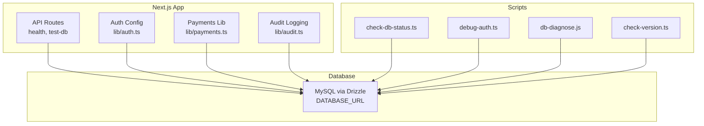
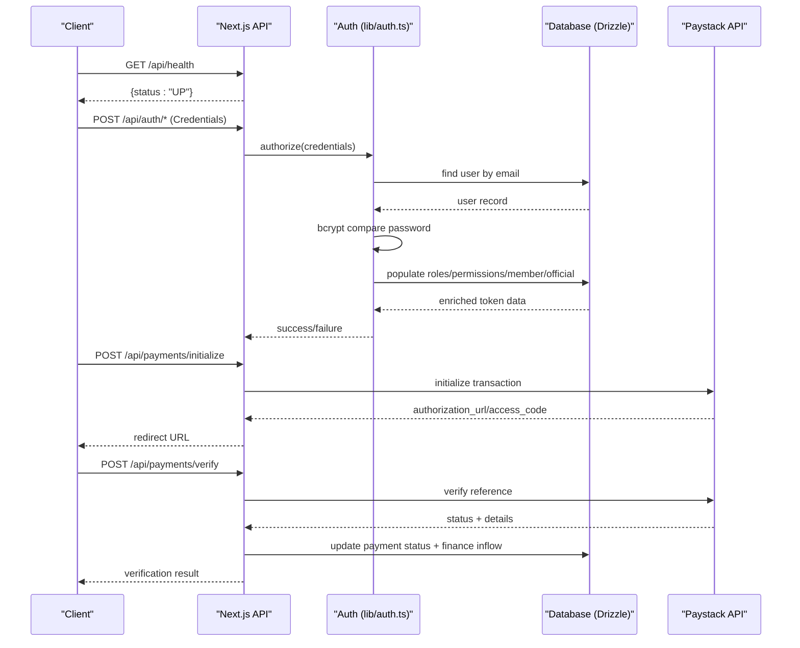
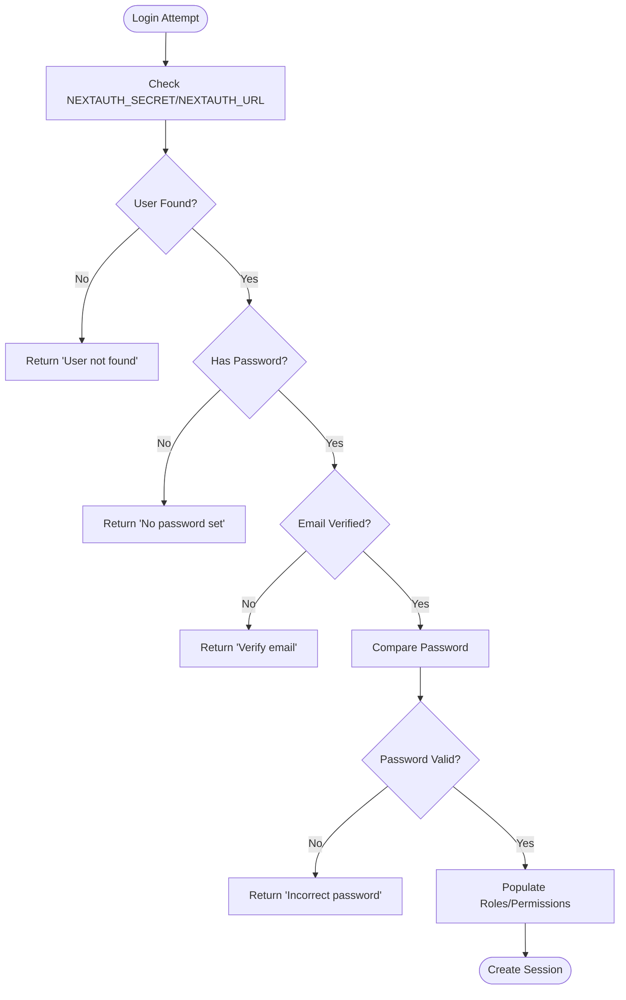
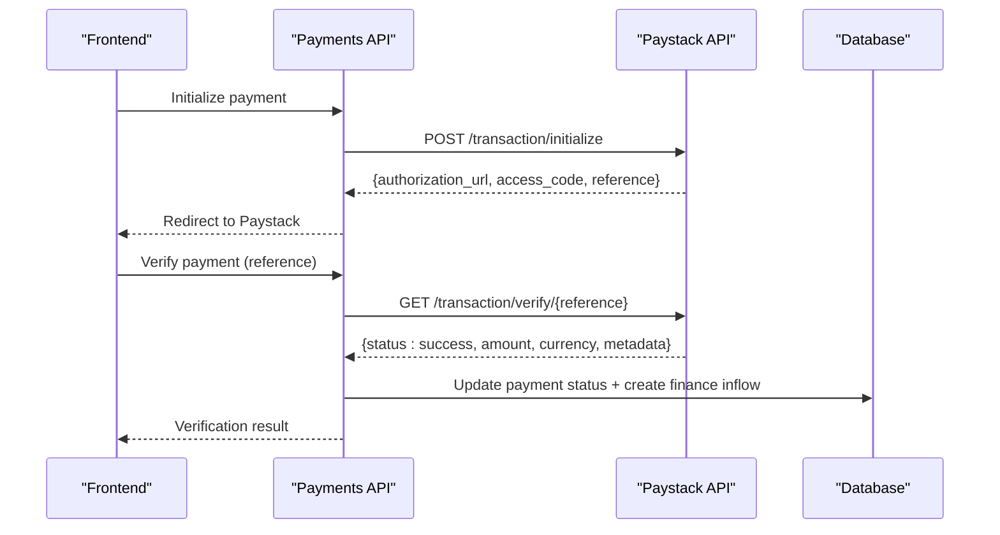
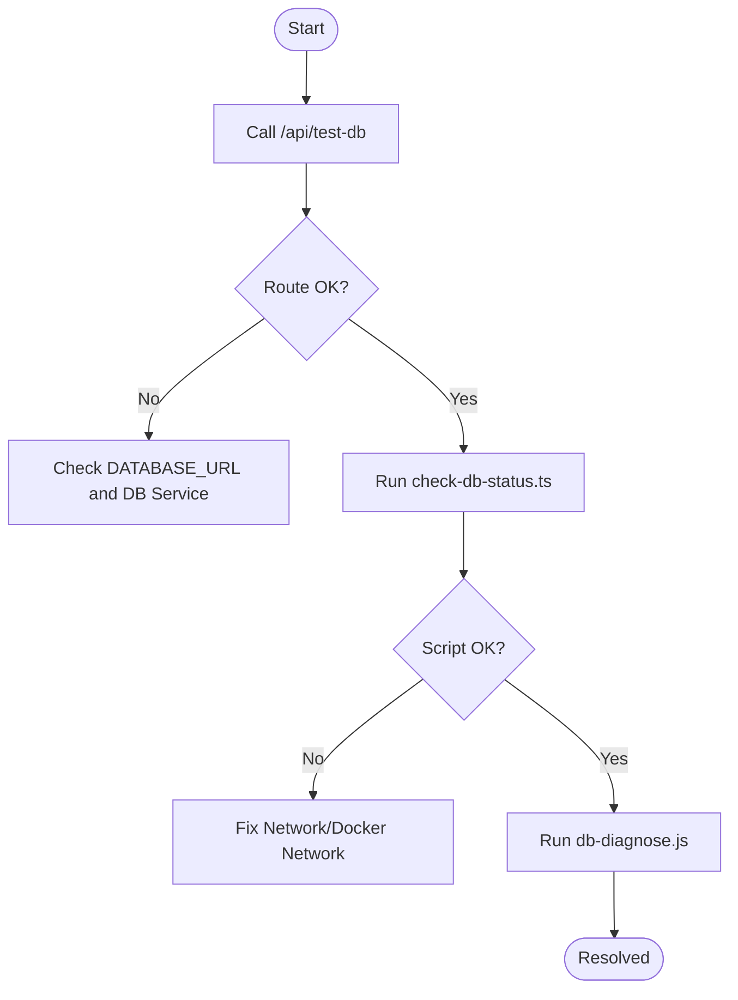
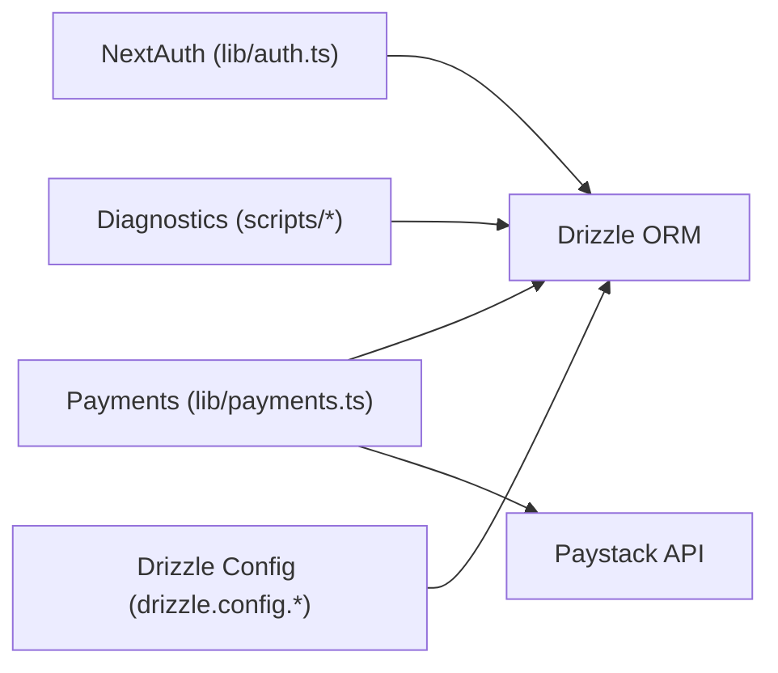

# Troubleshooting & FAQ

<cite>
**Referenced Files in This Document**
- [README.md](file://README.md)
- [SETUP.md](file://SETUP.md)
- [DEPLOYMENT_GUIDE_SERVER.md](file://DEPLOYMENT_GUIDE_SERVER.md)
- [lib/auth.ts](file://lib/auth.ts)
- [lib/payments.ts](file://lib/payments.ts)
- [app/api/health/route.ts](file://app/api/health/route.ts)
- [app/api/test-db/route.ts](file://app/api/test-db/route.ts)
- [scripts/check-db-status.ts](file://scripts/check-db-status.ts)
- [scripts/debug-auth.ts](file://scripts/debug-auth.ts)
- [scripts/db-diagnose.js](file://scripts/db-diagnose.js)
- [drizzle.config.ts](file://drizzle.config.ts)
- [drizzle.config.js](file://drizzle.config.js)
- [scripts/env-setup.ts](file://scripts/env-setup.ts)
- [scripts/check-version.ts](file://scripts/check-version.ts)
- [lib/audit.ts](file://lib/audit.ts)
- [app/dashboard/admin/audit/page.tsx](file://app/dashboard/admin/audit/page.tsx)
</cite>

## Table of Contents
1. Introduction
2. Project Structure
3. Core Components
4. Architecture Overview
5. Detailed Component Analysis
6. Dependency Analysis
7. Performance Considerations
8. Troubleshooting Guide
9. Conclusion
10. Appendices

## Introduction
This document provides comprehensive troubleshooting guidance for the TMC Portal, focusing on common setup issues (database connectivity, environment configuration, dependency conflicts), diagnostic tools and scripts, error log analysis, performance troubleshooting, platform-specific considerations, and community support resources. It is designed to help administrators and developers quickly identify and resolve problems during development and production operations.

## Project Structure
The TMC Portal is a Next.js 15 application with:
- API routes under app/api for authentication, payments, health checks, and database diagnostics
- Server-side logic and utilities in lib (auth, payments, audit logging)
- Diagnostic and maintenance scripts in scripts
- Configuration files for Drizzle ORM and environment loading
- Deployment and setup guides for Docker-based server deployment

**Diagram sources**
- [app/api/health/route.ts:1-6](file://app/api/health/route.ts#L1-L6)
- [app/api/test-db/route.ts:1-16](file://app/api/test-db/route.ts#L1-L16)
- [lib/auth.ts:1-257](file://lib/auth.ts#L1-L257)
- [lib/payments.ts:1-248](file://lib/payments.ts#L1-L248)
- [lib/audit.ts:1-48](file://lib/audit.ts#L1-L48)
- [scripts/check-db-status.ts:1-18](file://scripts/check-db-status.ts#L1-L18)
- [scripts/debug-auth.ts:1-68](file://scripts/debug-auth.ts#L1-L68)
- [scripts/db-diagnose.js:1-37](file://scripts/db-diagnose.js#L1-L37)
- [scripts/check-version.ts:1-15](file://scripts/check-version.ts#L1-L15)

**Section sources**
- [README.md:16-28](file://README.md#L16-L28)
- [README.md:82-102](file://README.md#L82-L102)

## Core Components
- Authentication: NextAuth.js with credentials provider, JWT sessions, role/permission population into tokens, and impersonation flows.
- Payments: Paystack integration for initialization, verification, subaccount creation, and bank listing; records payment events and updates financial inflows.
- Audit Logging: Captures user actions with metadata and IP/user-agent context; non-blocking to avoid impacting core flows.
- Health and Diagnostics: Simple health endpoint and DB test route; CLI scripts to verify DB connectivity, version, and schema inspection.

**Section sources**
- [lib/auth.ts:131-257](file://lib/auth.ts#L131-L257)
- [lib/payments.ts:18-96](file://lib/payments.ts#L18-L96)
- [lib/audit.ts:17-34](file://lib/audit.ts#L17-L34)
- [app/api/health/route.ts:1-6](file://app/api/health/route.ts#L1-L6)
- [app/api/test-db/route.ts:1-16](file://app/api/test-db/route.ts#L1-L16)

## Architecture Overview
The system integrates Next.js API routes with a MySQL database via Drizzle ORM. Authentication uses NextAuth with custom credential flow and token enrichment. Payments communicate with Paystack APIs and persist transactional data. Operational health is exposed through dedicated endpoints and scripts.

**Diagram sources**
- [app/api/health/route.ts:1-6](file://app/api/health/route.ts#L1-L6)
- [lib/auth.ts:146-183](file://lib/auth.ts#L146-L183)
- [lib/auth.ts:188-251](file://lib/auth.ts#L188-L251)
- [lib/payments.ts:18-96](file://lib/payments.ts#L18-L96)
- [lib/payments.ts:100-190](file://lib/payments.ts#L100-L190)

## Detailed Component Analysis

### Authentication Troubleshooting
Common issues:
- Missing or incorrect NEXTAUTH_SECRET/NEXTAUTH_URL
- User not found, no password set, or email not verified
- Incorrect password or bcrypt mismatch
- Role/permission population failures in JWT callback

Diagnostic steps:
- Use the debug-auth script to list recent users or verify a specific email/password hash.
- Confirm DATABASE_URL and that the users table exists and contains expected fields.
- Check session/JWT callbacks for errors logged to console.

Resolution strategies:
- Ensure NEXTAUTH_SECRET is generated and present.
- Verify NEXTAUTH_URL matches your domain.
- Set a valid password for credential-based sign-in.
- Confirm emailVerified flag is true before login attempts.
- Inspect logs for JWT/session callback errors and fix underlying DB queries if needed.

**Diagram sources**
- [lib/auth.ts:146-183](file://lib/auth.ts#L146-L183)
- [lib/auth.ts:188-251](file://lib/auth.ts#L188-L251)

**Section sources**
- [lib/auth.ts:146-183](file://lib/auth.ts#L146-L183)
- [lib/auth.ts:188-251](file://lib/auth.ts#L188-L251)
- [scripts/debug-auth.ts:7-68](file://scripts/debug-auth.ts#L7-L68)
- [SETUP.md:166-175](file://SETUP.md#L166-L175)

### Payment Processing Troubleshooting
Common issues:
- Invalid Paystack keys or network errors
- Callback/webhook not reachable or misconfigured
- Reference mismatches between frontend and backend
- Payment status not updated or financial inflow not recorded

Diagnostic steps:
- Verify PAYSTACK_SECRET_KEY and PAYSTACK_PUBLIC_KEY are set.
- Call the initialize and verify endpoints and inspect responses.
- Check logs for axios errors and response payloads.
- Confirm database records for payments and finance transactions after successful payments.

Resolution strategies:
- Correct any invalid keys or network issues.
- Ensure callback URLs are publicly accessible and correctly configured.
- Validate reference generation and matching across flows.
- Re-run verification or webhook handlers to reconcile missing updates.

**Diagram sources**
- [lib/payments.ts:18-96](file://lib/payments.ts#L18-L96)
- [lib/payments.ts:100-190](file://lib/payments.ts#L100-L190)

**Section sources**
- [lib/payments.ts:18-96](file://lib/payments.ts#L18-L96)
- [lib/payments.ts:100-190](file://lib/payments.ts#L100-L190)
- [SETUP.md:177-180](file://SETUP.md#L177-L180)

### Database Connectivity and Schema Diagnostics
Common issues:
- Incorrect DATABASE_URL or unreachable database
- Mismatched schema between Prisma/Drizzle and actual DB
- Network isolation in Docker preventing container-to-container DB access

Diagnostic steps:
- Use /api/test-db to validate DB connectivity from the running app.
- Run check-db-status.ts to test connection outside the app.
- Use db-diagnose.js to list tables and describe key tables.
- Use check-version.ts to confirm MySQL version.
- Review drizzle.config.ts/js for correct dialect and credentials.

Resolution strategies:
- Fix DATABASE_URL format and ensure the database service is reachable.
- Align schema migrations with the target database.
- In Docker, connect containers to the same network and use container names as hosts.

**Diagram sources**
- [app/api/test-db/route.ts:1-16](file://app/api/test-db/route.ts#L1-L16)
- [scripts/check-db-status.ts:1-18](file://scripts/check-db-status.ts#L1-L18)
- [scripts/db-diagnose.js:1-37](file://scripts/db-diagnose.js#L1-L37)
- [drizzle.config.ts:1-13](file://drizzle.config.ts#L1-L13)
- [drizzle.config.js:1-13](file://drizzle.config.js#L1-L13)

**Section sources**
- [app/api/test-db/route.ts:1-16](file://app/api/test-db/route.ts#L1-L16)
- [scripts/check-db-status.ts:1-18](file://scripts/check-db-status.ts#L1-L18)
- [scripts/db-diagnose.js:1-37](file://scripts/db-diagnose.js#L1-L37)
- [scripts/check-version.ts:1-15](file://scripts/check-version.ts#L1-L15)
- [drizzle.config.ts:1-13](file://drizzle.config.ts#L1-L13)
- [drizzle.config.js:1-13](file://drizzle.config.js#L1-L13)
- [DEPLOYMENT_GUIDE_SERVER.md:92-107](file://DEPLOYMENT_GUIDE_SERVER.md#L92-L107)

### File Uploads and Storage Issues
Symptoms:
- Upload failures or inaccessible file URLs
- Misconfigured storage endpoints or credentials

Diagnostics:
- Inspect upload API route behavior and storage library usage.
- Validate storage credentials and endpoints in environment variables.
- Check network access to storage providers.

Resolutions:
- Correct storage configuration and permissions.
- Ensure CDN/storage URLs are resolvable from clients.
- Retry uploads with appropriate timeouts and retries.

[No sources needed since this section provides general guidance]

### Error Log Analysis and Stack Traces
Techniques:
- Centralize logs from API routes and background workers.
- Correlate timestamps, request IDs, and user contexts.
- Use audit logs to trace user actions leading to errors.

Practical steps:
- Review console logs for auth and payment flows.
- Query audit logs via admin page to reconstruct sequences.
- Filter logs by userId, entityType, and date ranges.

**Section sources**
- [lib/audit.ts:17-34](file://lib/audit.ts#L17-L34)
- [app/dashboard/admin/audit/page.tsx:13-38](file://app/dashboard/admin/audit/page.tsx#L13-L38)

### Known Limitations, Workarounds, and Upgrade Considerations
Limitations:
- Audit logging is intentionally non-blocking; failures do not halt requests but may lose logs.
- Some scripts assume local .env.local precedence; ensure environment loading order is correct.

Workarounds:
- For migration issues, run migrations explicitly in production mode and seed data only once.
- If port conflicts occur, change PORT and update reverse proxy accordingly.

Upgrade considerations:
- Keep Drizzle and Prisma versions aligned with database schema.
- Validate environment variable changes across environments (dev vs prod).

**Section sources**
- [lib/audit.ts:17-34](file://lib/audit.ts#L17-L34)
- [drizzle.config.ts:1-13](file://drizzle.config.ts#L1-L13)
- [DEPLOYMENT_GUIDE_SERVER.md:142-145](file://DEPLOYMENT_GUIDE_SERVER.md#L142-L145)

### Platform-Specific Issues
Windows:
- Use PowerShell scripts where provided; ensure Node.js path is available globally.
- Validate line endings and encoding when running scripts.

Linux/macOS:
- Ensure executable permissions for shell scripts.
- Use container networking as documented for multi-service setups.

Docker:
- Connect all services to the same network and use container names as hosts for DB connections.
- Run migrations inside the container using docker exec.

**Section sources**
- [DEPLOYMENT_GUIDE_SERVER.md:60-78](file://DEPLOYMENT_GUIDE_SERVER.md#L60-L78)
- [DEPLOYMENT_GUIDE_SERVER.md:92-107](file://DEPLOYMENT_GUIDE_SERVER.md#L92-L107)

## Dependency Analysis
Key dependencies and their roles:
- NextAuth.js for authentication and session management
- Drizzle ORM for database access and migrations
- Axios for HTTP calls to Paystack
- MySQL as the primary data store
- Environment configuration via dotenv for scripts and configs

**Diagram sources**
- [lib/auth.ts:131-183](file://lib/auth.ts#L131-L183)
- [lib/payments.ts:1-96](file://lib/payments.ts#L1-L96)
- [drizzle.config.ts:1-13](file://drizzle.config.ts#L1-L13)
- [drizzle.config.js:1-13](file://drizzle.config.js#L1-L13)

**Section sources**
- [lib/auth.ts:131-183](file://lib/auth.ts#L131-L183)
- [lib/payments.ts:1-96](file://lib/payments.ts#L1-L96)
- [drizzle.config.ts:1-13](file://drizzle.config.ts#L1-L13)
- [drizzle.config.js:1-13](file://drizzle.config.js#L1-L13)

## Performance Considerations
- Slow queries: Identify heavy DB operations in auth token population and payment verification; add indexes where appropriate and limit result sets.
- Memory usage: Avoid loading large datasets into memory; paginate results in admin pages and audit log viewers.
- Caching effectiveness: Cache static configurations and frequently accessed lookups; invalidate caches on updates.
- External API latency: Implement retries and timeouts for Paystack calls; surface meaningful errors to clients.

[No sources needed since this section provides general guidance]

## Troubleshooting Guide

### Setup Problems
- Database connection issues:
  - Verify DATABASE_URL format and reachability.
  - Use /api/test-db and check-db-status.ts to validate connectivity.
  - In Docker, ensure containers share the same network and use container names as hosts.
- Environment configuration errors:
  - Ensure NEXTAUTH_SECRET and NEXTAUTH_URL are set.
  - Confirm RESEND_API_KEY and Paystack keys are present.
  - Check dotenv loading order in scripts and configs.
- Dependency conflicts:
  - Align Drizzle and Prisma versions with the database schema.
  - Re-generate clients and run migrations in the correct environment.

**Section sources**
- [SETUP.md:166-185](file://SETUP.md#L166-L185)
- [DEPLOYMENT_GUIDE_SERVER.md:28-58](file://DEPLOYMENT_GUIDE_SERVER.md#L28-L58)
- [app/api/test-db/route.ts:1-16](file://app/api/test-db/route.ts#L1-L16)
- [scripts/check-db-status.ts:1-18](file://scripts/check-db-status.ts#L1-L18)

### Debugging Guides
- Authentication failures:
  - Use debug-auth.ts to list users or verify password hashes.
  - Check for email verification status and presence of password.
  - Inspect JWT/session callbacks for errors.
- Payment processing errors:
  - Validate Paystack keys and network access.
  - Trace initialize and verify flows; check response messages.
  - Confirm payment status updates and finance inflow creation.
- File upload problems:
  - Validate storage credentials and endpoints.
  - Check network access and CORS settings if applicable.

**Section sources**
- [scripts/debug-auth.ts:7-68](file://scripts/debug-auth.ts#L7-L68)
- [lib/auth.ts:146-183](file://lib/auth.ts#L146-L183)
- [lib/payments.ts:18-96](file://lib/payments.ts#L18-L96)
- [lib/payments.ts:100-190](file://lib/payments.ts#L100-L190)

### Performance Troubleshooting
- Slow query identification:
  - Profile DB queries in auth token population and payment verification.
  - Add appropriate indexes and reduce payload sizes.
- Memory usage optimization:
  - Paginate large lists in admin interfaces.
  - Avoid unnecessary joins and select only required fields.
- Caching effectiveness:
  - Cache static settings and lookup tables.
  - Invalidate caches on updates to maintain consistency.

[No sources needed since this section provides general guidance]

### Diagnostic Tools and Scripts
- System health checks:
  - GET /api/health returns service status.
- Database diagnostics:
  - GET /api/test-db validates DB connectivity.
  - scripts/check-db-status.ts tests DB connection.
  - scripts/db-diagnose.js lists tables and describes schemas.
  - scripts/check-version.ts prints MySQL version.
- Service connectivity testing:
  - Use scripts to verify external services (e.g., Paystack) via payment functions.

**Section sources**
- [app/api/health/route.ts:1-6](file://app/api/health/route.ts#L1-L6)
- [app/api/test-db/route.ts:1-16](file://app/api/test-db/route.ts#L1-L16)
- [scripts/check-db-status.ts:1-18](file://scripts/check-db-status.ts#L1-L18)
- [scripts/db-diagnose.js:1-37](file://scripts/db-diagnose.js#L1-L37)
- [scripts/check-version.ts:1-15](file://scripts/check-version.ts#L1-L15)
- [lib/payments.ts:18-96](file://lib/payments.ts#L18-L96)

### Error Log Analysis Techniques
- Collect logs from API routes and worker processes.
- Use audit logs to reconstruct user actions and correlate with errors.
- Filter logs by userId, entityType, and time windows.

**Section sources**
- [lib/audit.ts:17-34](file://lib/audit.ts#L17-L34)
- [app/dashboard/admin/audit/page.tsx:13-38](file://app/dashboard/admin/audit/page.tsx#L13-L38)

### Community Resources and Support
- Repository issues and support email are listed in the project README.
- Contribution guidelines can be inferred from repository structure and documentation practices.

**Section sources**
- [README.md:178-181](file://README.md#L178-L181)

## Conclusion
This guide consolidates the most effective troubleshooting approaches for the TMC Portal, leveraging built-in endpoints and scripts to diagnose connectivity, authentication, payments, and performance issues. By following the step-by-step procedures and using the provided diagnostic tools, operators can quickly resolve common problems and maintain a healthy, performant system.

## Appendices

### Quick Reference: Essential Commands
- Health check: GET /api/health
- DB connectivity: GET /api/test-db
- DB status script: npx tsx scripts/check-db-status.ts
- Auth debug: npx tsx scripts/debug-auth.ts <email> [password]
- DB diagnosis: node scripts/db-diagnose.js
- MySQL version: npx tsx scripts/check-version.ts

**Section sources**
- [app/api/health/route.ts:1-6](file://app/api/health/route.ts#L1-L6)
- [app/api/test-db/route.ts:1-16](file://app/api/test-db/route.ts#L1-L16)
- [scripts/check-db-status.ts:1-18](file://scripts/check-db-status.ts#L1-L18)
- [scripts/debug-auth.ts:7-68](file://scripts/debug-auth.ts#L7-L68)
- [scripts/db-diagnose.js:1-37](file://scripts/db-diagnose.js#L1-L37)
- [scripts/check-version.ts:1-15](file://scripts/check-version.ts#L1-L15)